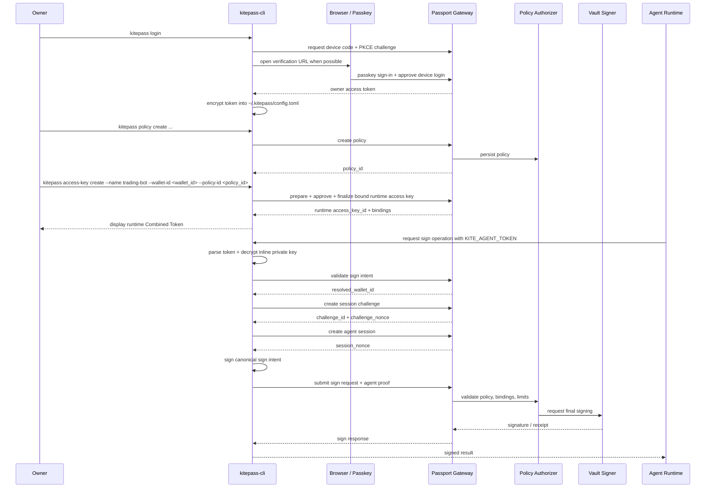

# Owner Token and Agent Access Key Flow

This document explains how `kitepass-cli` moves from owner authentication to
delegated agent signing in the current implementation.

Implementation note as of 2026-04-03:

- owner login currently uses device-code + PKCE with browser passkey approval
- the owner access token is stored encrypted under `~/.kitepass/config.toml`
- `sign submit` requires `KITE_AGENT_TOKEN` and performs
  `validate -> session challenge -> session create -> final submit`
- `sign validate` can run with either `KITE_AGENT_TOKEN` or a logged-in owner
  session

## Identity Split

The flow is intentionally split into two identities:

- **Owner identity**
  - used for wallet import, access-key provisioning, policy management, and
    other administrative actions
- **Agent identity**
  - used at runtime by an autonomous agent to request signing within an
    already-provisioned policy boundary

That split is the core security property of the system. The owner grants
authority. The agent only uses the authority that was granted.

## High-Level Flow



## Step 1: Owner Login Produces an Owner Token

The owner starts by running:

```bash
kitepass login
```

`kitepass-cli` starts the owner authentication flow through Passport Gateway.
The CLI requests a device code, generates a PKCE verifier / challenge pair,
opens a browser when possible, and the user completes passkey authentication
plus device approval there.

If authentication succeeds, Gateway returns an **owner access token**. The CLI:

- encrypts that token into `~/.kitepass/config.toml`
- stores the local decrypt secret in `~/.kitepass/access-token.secret`

This token is an **administrative credential**. It is not used for runtime
transaction signing. It is only used for owner-level actions such as:

- importing wallets
- creating agent access keys
- approving delegated authority
- managing policies

## Step 2: The Owner Uses the Token To Provision Delegated Runtime Authority

Today, the most reliable signing path is policy-first:

1. create a policy for the wallet
2. activate that policy
3. create the bound runtime access key that references the approved `policy_id`

The commands look like this:

```bash
kitepass policy create \
  --name trading-policy \
  --wallet-id <wallet_id> \
  --allowed-chain eip155:8453 \
  --allowed-action transaction \
  --max-single-amount 100 \
  --max-daily-amount 1000 \
  --allowed-destination 0xabc \
  --valid-for-hours 24

kitepass policy activate --policy-id <policy_id>

kitepass access-key create \
  --name trading-bot \
  --wallet-id <wallet_id> \
  --policy-id <policy_id>
```

During `access-key create`, the CLI:

1. generates a new Ed25519 keypair locally
2. derives a random secret and encrypts the private key into an inline
   `CryptoEnvelope`
3. sends only the public key to Passport using the owner access token
4. completes the prepare -> approve -> finalize provisioning flow
5. prints a one-time Combined Token for the agent runtime

The important property here is that the **private key never leaves the local
machine**. Passport only receives the public key plus the owner-approved
delegation state.

After provisioning succeeds, the CLI stores the agent identity in:

- `~/.kitepass/agents.toml`

That record contains the local profile name, the Passport `access_key_id`, the
public key hex, and the encrypted private-key envelope. The Combined Token
itself is not stored on disk.

## Step 3: The Agent Uses the Access Key To Call Passport

At runtime, the agent does not use the owner token. It uses the **Combined
Token plus the local encrypted profile**.

When the agent wants a signature, the CLI:

1. parses `KITE_AGENT_TOKEN` into `access_key_id` + `secret_key`
2. loads the matching encrypted profile from `agents.toml`
3. decrypts the local private key in memory
4. calls `validate_sign_intent`
5. receives the resolved wallet route
6. asks Passport to create a session challenge
7. signs the challenge payload locally and creates an agent session
8. receives a `session_nonce`
9. builds a canonical sign intent
10. signs that intent locally with the decrypted access-key private key
11. sends the sign request plus the resulting `agent_proof` to Passport

Passport then verifies:

- the access key is registered and active
- the access key is bound to the target wallet selected for the requested
  CAIP-2 `chain_id`
- the requested action matches the assigned policy
- value, destination, and quota limits are still valid
- the `agent_proof` matches the registered public key

If all checks pass, the request proceeds through Policy Authorizer and then
Vault Signer.

For diagnostics, `kitepass sign validate` can also run under the logged-in
owner session without `KITE_AGENT_TOKEN`. That path is useful for route and
policy debugging, but it is not the final runtime signing path.

## Why the Split Matters

This design keeps the two trust levels separate:

- The **owner token** can grant or revoke authority, but it is not meant to be
  held by an autonomous agent.
- The **Combined Token** can unlock the local encrypted agent key, but only for
  the specific `access_key_id` that the owner provisioned.

That means an agent can operate continuously without holding the owner's full
administrative power.

## Practical Summary

In one sentence:

> The owner token is used to create and approve delegated authority, while the
> Combined Token unlocks the encrypted local agent key that exercises that
> authority at runtime.

This gives the system a clean separation between:

- **management plane**
  - owner login, provisioning, policy changes
- **runtime plane**
  - agent proof, policy validation, final signing
