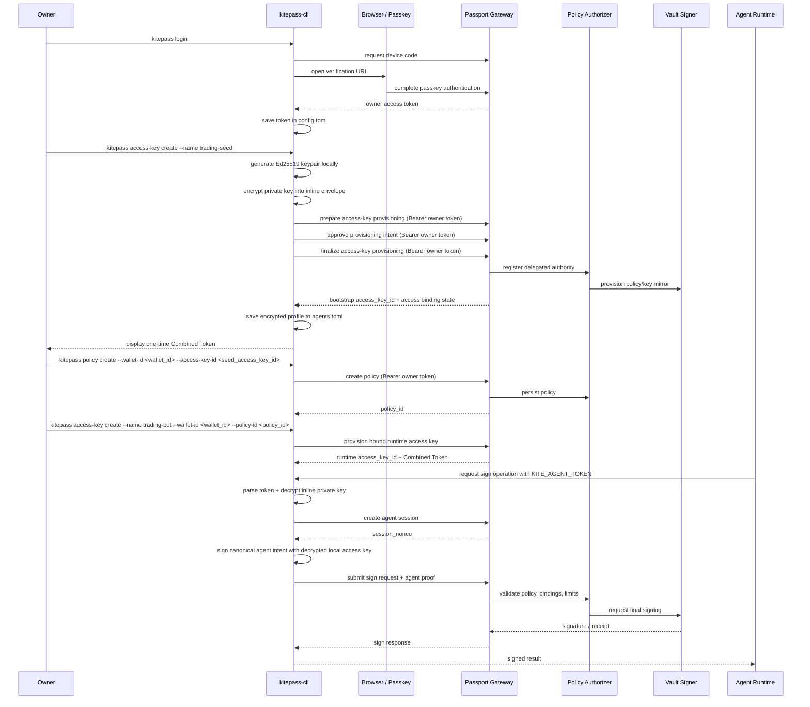

# Owner Token and Agent Access Key Flow

This document explains how `kitepass-cli` moves from owner authentication to delegated agent signing.

The flow is intentionally split into two identities:

- **Owner identity**: used for administrative actions such as wallet import, access-key provisioning, and policy management.
- **Agent identity**: used at runtime by an autonomous agent to request signing within a restricted policy boundary.

That split is the core security property of the system. The owner grants authority. The agent only uses the authority that was granted.

## High-Level Flow



## Step 1: Owner Login Produces an Owner Token

The owner starts by running:

```bash
kitepass login
```

`kitepass-cli` starts the owner authentication flow through the Passport Gateway. The CLI requests a device code, opens a browser, and the user completes passkey authentication there.

If authentication succeeds, the Gateway returns an **owner access token**. The CLI stores that token in `~/.kitepass/config.toml`.

This token is an **administrative credential**. It is not used for transaction signing. It is only used for owner-level actions such as:

- importing wallets
- creating agent access keys
- approving delegated authority
- managing policies

## Step 2: The Owner Uses the Token To Provision Delegated Runtime Authority

Today, the most reliable signing path is a two-stage provisioning flow:

1. create a bootstrap access key
2. create a policy using that bootstrap `access_key_id`
3. create the bound runtime access key that references the approved `policy_id`

The commands look like this:

```bash
kitepass access-key create --name trading-seed

kitepass policy create \
  --name trading-policy \
  --wallet-id <wallet_id> \
  --access-key-id <seed_access_key_id> \
  --allowed-chain eip155:8453 \
  --allowed-action transaction \
  --max-single-amount 100 \
  --max-daily-amount 1000 \
  --allowed-destination 0xabc \
  --valid-for-hours 24

kitepass policy activate --policy-id <policy_id>

kitepass access-key create --name trading-bot --wallet-id <wallet_id> --policy-id <policy_id>
```

During this step, the CLI:

1. generates a new Ed25519 keypair locally
2. derives a random secret and encrypts the private key into an inline `CryptoEnvelope`
3. sends the public key to Passport using the owner access token
4. completes the owner-approved provisioning flow
5. prints a one-time Combined Token for the agent runtime

The important property here is that the **private key never leaves the local machine**. Passport only receives the public key plus the owner-approved delegation state.

After provisioning succeeds, the CLI stores the agent identity in:

- `~/.kitepass/agents.toml`

That record contains the local profile name, the Passport `access_key_id`, the public key hex, and the encrypted private-key envelope. The Combined Token itself is not stored on disk.

## Step 3: The Agent Uses the Access Key to Call Passport

At runtime, the agent does not use the owner token. It uses the **Combined Token plus the local encrypted profile**.

When the agent wants a signature, the CLI:

1. parses `KITE_AGENT_TOKEN` into `access_key_id` + `secret_key`
2. loads the matching encrypted profile from `agents.toml`
3. decrypts the local private key in memory
4. asks Passport to create an agent session
5. receives a `session_nonce`
6. builds a canonical sign intent
7. signs that intent locally with the decrypted access-key private key
8. sends the sign request plus the resulting `agent_proof` to Passport

Passport then verifies:

- the access key is registered and active
- the access key is bound to the target wallet selected for the requested CAIP-2 `chain_id`
- the requested action matches the assigned policy
- value, destination, and quota limits are still valid
- the `agent_proof` matches the registered public key

If all checks pass, the request proceeds through the Policy Authorizer and then the Vault Signer.

## Why the Split Matters

This design keeps the two trust levels separate:

- The **owner token** can grant or revoke authority, but it is not meant to be held by an autonomous agent.
- The **Combined Token** can unlock the local encrypted agent key, but only for the specific `access_key_id` that the owner provisioned.

That means an agent can operate continuously without holding the owner's full administrative power.

## Practical Summary

In one sentence:

> The owner token is used to create and approve delegated authority, while the Combined Token unlocks the encrypted local agent key that exercises that authority at runtime.

This gives the system a clean separation between:

- **management plane**: owner login, provisioning, policy changes
- **runtime plane**: agent proof, policy validation, final signing
